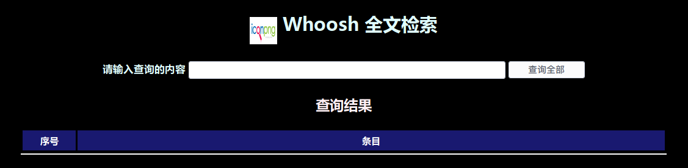

# jiansuo —— Based on Whoosh
## Required
These things are written in the file requirements.txt.\
**Needed Environment**
>python 3.7.0

**Needed Libraries**
>whoosh == 2.7.4\
django == 2.1.2\
pytz == 2018.5\
jieba == 0.39

**Needed Resources**\
such as QQ, 163 and others.
## Install
> https://github.com/iamywang/jiansuo.git

> pip install -r requirements.txt
## Quick Start
> python3 manage.py 'DJANGO_SETTINGS_MODULE', 'jiansuo.settings'

>> **'DJANGO_SETTINGS_MODULE'**

If you want to start, here should be runserver.
>> **'jiansuo.settings'**

You can set the port such as 8080.
## How to find something
If you have already configured it,please open your browser and start development server at 
> http://127.0.0.1:port/

Port is port that you haved set before.
## Demo
1.RUN COMMAND
> python3 manage.py runserver 127.0.0.1:12345

2.OPEN BROWSER\
Open gnome-terminal and  enter **firefox**
>firefox

In the address bar, enter **127.0.0.1:12345**
>127.0.0.1:12345

And you can search sonething you need based on my database.

## Dockerfile - optional
I have already written the relevant configuration file, just need to configure a python 3.7.0 version of the docker virtual machine to use.

**References**
>https://www.cnblogs.com/alexkn/p/4256440.html

**Command**\
Install a python 3.7.0 docker\
First you should use `cd` to the directory where your files are, and use the follow command.
>sudo docker build -t jiansuo .

Run the docker
> sudo docker run -d \
     -e APP_CONFIG=application.config.example \
     -e AWS_ACCESS_KEY_ID=$AWS_ACCESS_KEY_ID \
     -e AWS_SECRET_ACCESS_KEY=$AWS_SECRET_ACCESS_KEY \
     -p 12345:12345 \
jiansuo

Stop the docker
> sudo docker ps

You can find the docker you have run.\
Next, you should use
>sudo docker stop [CONTAINER ID]

CONTAINER ID is your docker's CONTAINER ID.
## Apache 2.4 - optional
Although Django has a server, you can also attach your python web application to apache.

**References**
>https://code.ziqiangxuetang.com/django/django-deploy.html\
https://www.cnblogs.com/Junsept/p/6862595.html
